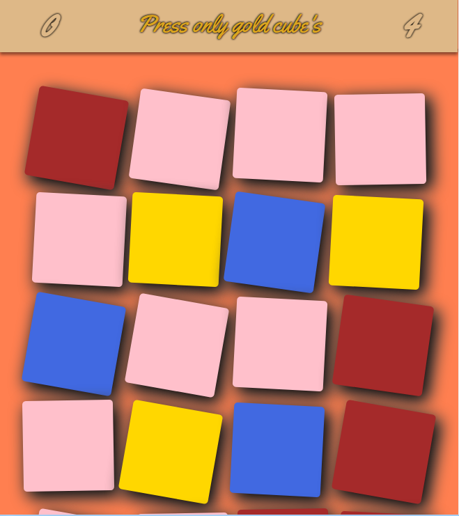

# Cube-Game

When asked which color you choose, the game generates 23 cubes and you have to click on the cubes of your chosen color.
If you make three mistakes, it's game over. If you clear all the cubes you are looking for, you win.

The game is very easy and it is more for children, but at least, it was a good practice to coding it.
